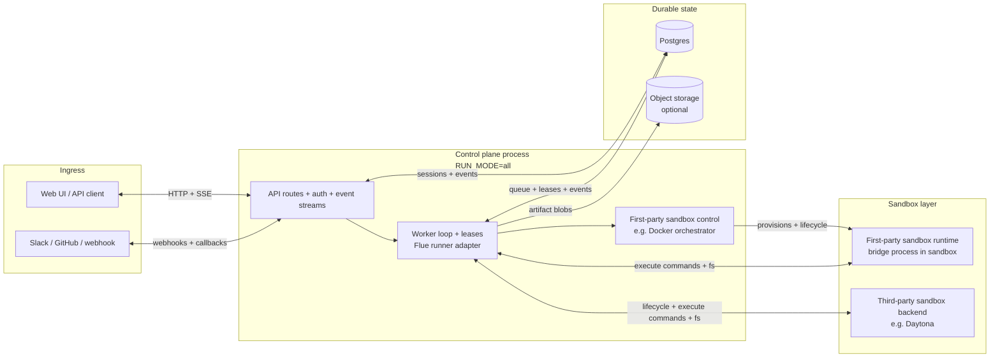
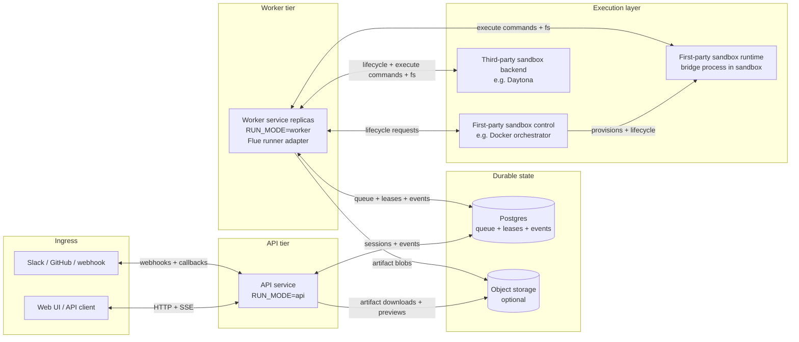

# Architecture

## Summary

The system is a portable background-agent control plane with Flue as the agent runtime. Flue already provides agent sessions, tools, skills, tasks/subagents, live events, and sandbox connector abstractions. This service provides the product control plane around those capabilities: durable queueing, leases, integrations, artifacts, replayable events, and portable deployment state.

The system should be deployable to:

- Railway: one service plus Postgres, with optional object storage and Redis later.
- VM or bare metal host(s): Docker Compose for the control plane and durable infrastructure, with the Docker orchestrator managing sandbox containers through a colocated or remote Docker daemon.
- ECS Fargate + RDS: one task/service plus RDS, optionally split into API and worker services.
- Kubernetes: one Deployment plus Postgres and object storage, optionally split into multiple Deployments.

Cloud-specific primitives such as Durable Objects, D1, KV, or provider-native queues must not be required for correctness.

## Deployment Modes

The control plane can run as a monolith or as split services. Both modes share the same schema, queueing model, leases, integrations, and sandbox contracts.

Terminology in this document:

- `SandboxProvider` is the code-level adapter interface inside `apps/control-plane/src/sandbox`.
- A sandbox backend is the runtime system the adapter controls or calls, such as Docker, local processes, Daytona, Kubernetes, or ECS.
- First-party sandbox backends are operated by this system and can separate backend control from sandbox runtime.
- Third-party sandbox backends own both their control API and runtime environment behind an external service boundary.

Run modes:

```txt
RUN_MODE=all       # API + worker in one process
RUN_MODE=api       # API only
RUN_MODE=worker    # worker only
```

### Monolith Mode

Monolith mode runs API, integration, event streaming, worker, runner, and sandbox lifecycle work in one process. It is the smallest operational shape.

Responsibilities:

- API, auth, integration webhooks, and event streams.
- Queue writes, worker polling, run leases, Flue execution, and event normalization.
- Sandbox lifecycle and cleanup.
- Durable state in Postgres, with optional large artifact storage.

```txt
background-agent service
  Hono HTTP API
  worker loop
  event streaming
  integration routes
  Flue runner adapter
  sandbox lifecycle manager
  Postgres store

Postgres
  sessions
  messages
  events
  runs
  sandboxes
  flue_sessions
  artifacts
  external thread mappings

Object storage, optional at first
  stored artifact blobs
  logs
  screenshots
  large artifacts
```



### Split-Service Mode

Split-service mode runs API and workers as separate processes so they can scale, isolate resources, and roll out independently.

The API does not call workers directly. It writes durable state to Postgres; workers claim runnable work from Postgres using leases.

API responsibilities:

- API, auth, integration webhooks, and event streams.
- Request validation, integration normalization, queue writes, dedupe, and state reads.
- Cancellation/archive requests. The API does not execute agent runs.

Worker responsibilities:

- Polling, run leases, heartbeats, stale lease recovery, and active-run exclusivity.
- Sandbox lifecycle, Flue execution, cancellation, and event normalization.
- Artifact recording and run/message finalization.

Shared durable state:

- Postgres stores sessions, messages, runs, leases, events, sandbox records, auth sessions, and integration mappings.
- Object storage is optional for large artifacts; Postgres remains the source of truth for artifact metadata.



Sandbox backends have two shapes. First-party backends separate sandbox control from sandbox runtime. Docker is the current example, but the shape also fits Firecracker, EC2, Kubernetes, or ECS. Workers use first-party control for lifecycle operations, then talk directly to the sandbox bridge for shell/filesystem work. Third-party backends, such as Daytona, colocate control and runtime behind the backend API.

Product custom tools run in the trusted worker process. Sandbox-backed shell/filesystem tools run through the sandbox bridge. With first-party backends, lifecycle traffic and tool traffic are separate; with third-party backends, both go through the backend API.

With `SANDBOX_PROVIDER=docker`, Docker orchestration can run in-process or as a separate HTTP service.

Docker orchestrator responsibilities:

- Hold Docker daemon access and runtime configuration.
- Create, start, stop, inspect, and destroy sandbox containers.
- Keep API and worker services free of direct Docker socket access.

The preferred Docker orchestrator deployment is colocated with the Docker daemon and uses the daemon's Unix socket. API and worker services authenticate only to the orchestrator HTTP API; they never receive Docker socket access.

Remote Docker daemon access is possible via `DOCKER_HOST`, `DOCKER_TLS_VERIFY`, and `DOCKER_CERT_PATH`. In that shape, Docker auth is handled by Docker transport credentials, while API/worker-to-orchestrator auth still uses `DOCKER_ORCHESTRATOR_TOKEN`.

### Process Lifecycle

- `SIGTERM` and `SIGINT` trigger graceful shutdown.
- The HTTP server stops accepting new requests.
- Worker polling stops and waits for any in-flight `processNext()` call to finish.
- Postgres-backed stores are closed before process exit.
- Shutdown has a bounded timeout so orchestrators such as Railway, ECS, and Kubernetes can terminate predictably.

## Flue Node Deployment Implications

Flue's Node deployment target already builds a Node server with:

- `GET /health`
- `GET /agents`
- `POST /agents/:name/:id`
- sync responses
- live SSE responses
- webhook/fire-and-forget mode

It also supports the Node sandbox progression documented by Flue:

```txt
empty virtual sandbox
  -> virtual sandbox with shell setup
  -> local sandbox using host filesystem
  -> remote sandbox through a connector
```

For this product, there are two viable integration shapes:

1. **Embedded Flue runner inside product API/worker**, preferred for the portable control plane.
2. **Delegate to a generated Flue server**, useful for standalone Flue agents or smoke tests.

The preferred MVP remains embedded Flue execution behind `runner-flue`, because we need durable Postgres-backed queues, run leases, integration dedupe, artifacts, and replayable product events around the agent run. Flue's generated Node server is not a durable work queue by itself.

The implementation should still align with Flue's Node deployment model:

- use `init({ persist })` for Postgres-backed Flue session persistence;
- use `agent.session()` rather than custom conversation history;
- use Flue commands/tools/MCP rather than building a parallel tool registry;
- use Flue sandbox connectors for remote environments;
- treat Flue live events as input to our product event log.

The embedded runner uses Flue the same way the generated Node server does: construct a `createFlueContext()` in the worker process, then call `init()`. The difference is that our `init()` receives a product-managed provider sandbox via a Flue `SandboxFactory`, plus the Postgres-backed Flue `SessionStore`, instead of relying on the generated server's default in-memory store.

Flue live events are normalized before being written to the product event log:

- `text_delta` -> `agent_text_delta`.
- `tool_start` and `command_start` and `task_start` -> `tool_started`.
- `tool_end` and `command_end` and `task_end` -> `tool_finished`.
- low-level lifecycle events such as `agent_start`, `turn_end`, `idle`, and compaction events are currently ignored unless they need product-visible UI later.

## Flue Custom Tools

Flue custom tools passed through `init({ tools })` are the preferred non-MCP extension point when we need authenticated or policy-scoped capabilities that should not expose raw credentials to the agent shell. They are useful for narrow provider actions and pragmatic CLI-backed operations such as the GitHub `gh` tool.

Execution boundary:

- A custom tool handler runs in the trusted worker/runner process that called `init()`, not inside the remote Daytona sandbox.
- The model sees the tool schema, description, arguments, and returned text, but not process-local secrets unless the handler returns them.
- The tool can use service environment variables, minted provider tokens, stores, provider clients, and other backend-only dependencies.
- Tool handlers should return concise structured text and redact secrets from stdout, stderr, API errors, and thrown messages.

Side-effect boundary:

- Provider API side effects happen wherever the provider API applies them, for example creating a GitHub issue or comment.
- Database side effects happen in our service database if the handler calls stores directly.
- Filesystem side effects from ordinary Node filesystem APIs happen in the worker container and usually should be avoided for task workspaces.
- Filesystem side effects intended for the agent workspace must be routed through Flue session/agent shell or sandbox APIs, for example startup `session.shell(...)` or prompt-time agent-level `shell(...)`, so they occur in the remote sandbox worktree.

Security model:

- Custom tools protect the credential boundary by exposing a capability instead of a bearer token.
- They do not automatically protect the permission boundary; broad tools still allow broad behavior within the token/app permissions.
- Keep provider tokens short-lived, repo-scoped when possible, and never persisted in messages, events, artifacts, callbacks, prompts, or Flue session history.
- Validate tool inputs server-side even if the schema is strict; models can still request unsafe or nonsensical operations.
- Prefer product-policy checks in the handler, such as repository allowlists, blocked subcommands, route allowlists, timeouts, non-interactive modes, temporary config directories, and output redaction.
- Log operation metadata and outcomes, not secret-bearing command lines, environment values, or raw provider auth headers.

Choosing an extension point:

- Use a Flue custom tool when the operation belongs to our trusted backend policy layer and can be represented as a model-callable capability.
- Use remote MCP when a high-quality provider MCP server or our own MCP server gives the right tool surface and lifecycle semantics.
- Use `session.shell(..., { env })` for one-off trusted setup commands that must mutate the remote sandbox, such as clone/fetch, with command-scoped credentials.
- Avoid session-scoped shell credentials for general agent use; they are easier to leak into logs, files, command output, model context, or artifacts.
- Avoid `defineCommand` for the current Daytona remote path; it is a local/bash-runtime command registration mechanism and does not provide the same tool surface for our remote sandbox sessions.

Current examples:

- Repository clone/fetch uses `session.shell(..., { env: { GITHUB_AUTH_HEADER } })` because the side effect must create or update files inside the remote sandbox.
- Dynamic repository selection uses the `repository` custom tool. `set` validates and persists session repo context, `list` helps the agent ask for clarification when uncertain, and `prepare` clones/fetches the selected repo inside the sandbox during the active run.
- GitHub issue/PR API operations can use the `gh` custom tool, but final GitHub issue/PR comments are intentionally blocked there and are posted through the callback layer to avoid duplicate external replies.
- Authenticated git network operations such as push use the `git` custom tool. Its handler runs in trusted worker code, but it calls Flue agent-level `shell(...)` so the actual git process and object transfer happen inside the remote sandbox repository with command-scoped credentials while the prompt is active.
- Local file edits and local commits should use sandbox tools such as `write`, `edit`, and `bash`; publishing those commits should use the authenticated `git` tool rather than trying to use `gh` API refs for sandbox-local objects.
- Guardrails block raw GitHub Git Database API routes through `gh` and risky authenticated `git push` forms such as force, mirror, and delete refspecs.

If we later expose raw Flue agent endpoints, they should be clearly separated from product session endpoints:

```txt
/agents/:name/:id             # Flue-native invocation shape
/sessions/:id/messages        # product background-work shape
```

The product API may call into Flue internally, but external integrations should continue to enqueue durable product messages rather than directly relying on Flue's fire-and-forget Node mode.

## Module Layout

Strong module boundaries are also an agent-development constraint, not only a software design preference. Each module should expose small contracts so future coding agents can load the relevant files for one task without pulling the entire system into context. When a feature crosses boundaries, the contract should carry intent in typed inputs/outputs rather than requiring an agent to inspect unrelated internals.

This has practical consequences:

- HTTP routes should call services instead of embedding product logic.
- Hono middleware should own transport-wide concerns like request IDs, auth, CORS, body limits, and error shaping.
- Store implementations should hide SQL details behind narrow methods.
- Integration modules should normalize external payloads before they reach session/message code.
- Runner modules should own runner-specific protocol details and publish normalized events.
- Tests should verify contracts at module boundaries so agents can safely change internals without widening context.

```txt
apps/control-plane/src/
  app/
  auth/
  callbacks/
  config/
  events/
  artifacts/
  sessions/
  messages/
  worker/
  runner/
  runner-flue/
  sandbox/
  integrations/
    generic-webhook/
    github/
    slack/
    shared-utils.ts
  repositories/
  store/

apps/web/

packages/

docs/
```

## Responsibility Split

| Module         | Owns                                                                                 | Does Not Own                                 |
| -------------- | ------------------------------------------------------------------------------------ | -------------------------------------------- |
| `api`/`app`    | Hono routes, request validation, auth boundaries, response formatting, middleware    | Agent execution, sandbox lifecycle decisions |
| `app`          | Process bootstrap, run mode, graceful shutdown                                       | Business logic                               |
| `sessions`     | Durable task workspace lifecycle and status                                          | SQL details, Flue calls                      |
| `messages`     | Prompt/follow-up queue semantics                                                     | Running prompts                              |
| `worker`       | Claiming runnable work and coordinating execution                                    | HTTP concerns                                |
| `runner-flue`  | Flue initialization and event normalization                                          | Session persistence policy                   |
| `sandbox`      | Provider interface, lifecycle, health, cleanup                                       | Prompt construction                          |
| `integrations` | External webhook/auth normalization, source-specific prompt rendering, and callbacks | Direct agent execution                       |
| `events`       | Append-only event log, replay, subscriber fanout                                     | Business decisions                           |
| `artifacts`    | PRs, branches, screenshots, object links, reports                                    | Raw runner protocol                          |
| `store`        | Postgres queries, migrations, transactions                                           | Domain decisions                             |
| `config`       | Env parsing, validation, feature flags                                               | Business logic                               |
| `auth`         | App/user/service auth helpers                                                        | Route-specific request handling              |
| `prompts`      | Prompt templates and source-specific context rendering                               | External API calls                           |

## Dependency Rules

Allowed dependency direction:

```txt
api -> sessions/messages/events/auth
worker -> messages/sessions/runs/sandbox/runner-flue/events/artifacts
integrations -> sessions/messages/events/prompts/auth
runner-flue -> events/sandbox/prompts
sandbox -> store/config
sessions/messages/runs/events/artifacts -> store
store -> postgres driver + shared record/event types
```

Forbidden dependencies:

```txt
api/app -> runner-flue, except src/index.ts
integrations -> runner-flue
sessions/messages -> integration-specific modules
runner-flue -> api/app/integrations
store -> domain services
```

`apps/control-plane/src/index.ts` is the composition root exception. It is allowed to wire concrete stores, runners, sandboxes, and integrations because process startup is where configuration is translated into concrete dependencies. Other API/app modules must depend on service contracts instead of runner implementations.

Only `runner-flue` should import `@flue/sdk`. This keeps Flue replaceable and makes tests easier. Provider SDKs should stay in provider-specific adapters, such as `apps/control-plane/src/sandbox/daytona.ts` for `@daytona/sdk`. Store implementations may import shared data types, but must not import session/message/event service classes.

The HTTP transport uses Hono on Node via `@hono/node-server`. This keeps the API layer lightweight while giving us middleware hooks for auth, request IDs, CORS, body limits, and route grouping as integrations grow.

Product session routes support `API_AUTH_MODE=none|bearer|session`; the mode is required so deployments fail to start instead of silently running open. `/health` remains public and reports the active mode and session provider. Bearer mode uses `API_BEARER_TOKEN` for machine/developer access. Session mode uses an opaque HTTP-only `dev_deputies_session` cookie backed by the configured app data store (`auth_sessions` in Postgres for durable deployments); the browser never receives user tokens or signed user payloads. `AUTH_PROVIDER=static` enables `POST /auth/login` with local static credentials, while `AUTH_PROVIDER=github` uses GitHub App user authorization through `GET /auth/oauth/github/start` and `GET /auth/oauth/github/callback`. GitHub App login uses `GITHUB_OAUTH_CLIENT_ID`, `GITHUB_OAUTH_CLIENT_SECRET`, and `GITHUB_OAUTH_CALLBACK_URL`; runtime repository access still uses `GITHUB_APP_ID` and `GITHUB_APP_PRIVATE_KEY` to mint installation tokens. Generic webhooks keep their own per-source bearer auth so external systems can be authorized independently from product API clients.

Current session-cookie auth is an API access gate only. Product sessions remain multiplayer/shared by default: authenticated users can list and open the same global session set, and sessions are not currently owned by or filtered to the authenticated user.

Session-scoped product state is exposed through the product API. Artifact reads use `GET /sessions/:sessionId/artifacts` and are protected by the same product session auth as session, message, and event routes.

Stored artifact blobs are optional and live behind the `artifacts` service. Postgres remains the source of truth for artifact metadata. When `ARTIFACT_STORAGE_PROVIDER=filesystem|s3` is configured, workers can store artifact bytes in object storage and the API proxies authenticated downloads and text previews through `GET /sessions/:sessionId/artifacts/:artifactId/download` and `GET /sessions/:sessionId/artifacts/:artifactId/preview`. When storage is disabled, external-link artifacts still work and blob-producing paths fail clearly.

JSON request bodies are capped by `MAX_JSON_BODY_BYTES` and malformed/non-object bodies produce stable JSON error envelopes. This prevents transport parsing failures from leaking as generic internal errors.

`runner-flue` must also provide or configure a Postgres-backed Flue session store. Flue's Node default is in-memory and is not acceptable for production, CI, UAT, or multi-replica deployments. Product state and Flue runtime state are separate but both must be durable.

## Request Flow

When a user or integration sends a prompt:

```txt
POST /sessions/:id/messages or integration webhook
  -> validate request
  -> find or create session
  -> reject if the session is archived
  -> append pending message
  -> append message_created event
  -> return 202 Accepted
```

No model call happens in the request path.

Worker execution:

```txt
worker loop
  -> claim all pending messages for one session using Postgres transaction
  -> create/renew session run lease
  -> ensure sandbox exists and is healthy
  -> start Flue runner
  -> normalize Flue/sandbox events into event log
  -> record artifacts
  -> mark claimed batch completed, failed, or cancelled
  -> release lease
```

## Concurrency Model

Correctness must not depend on a single process.

The code must behave correctly with multiple replicas even when deployed in `RUN_MODE=all`. Any code path that allocates durable work or processes work must use Postgres-backed concurrency controls. The current store uses database-backed per-session sequence counters and Postgres-backed run leases, including active/cancelling run exclusivity and stale lease recovery.

Rules:

- Multiple API replicas may receive messages for the same session.
- Multiple worker replicas may poll concurrently.
- Only one active run may process a session at a time.
- Follow-up messages queue behind the active run. The worker claims all currently pending messages for a session as one ordered batch and prompts the runner with those messages in sequence.
- Pending messages can be edited or cancelled before claim. Editing pauses the session queue until the edit is saved or cancelled.
- Archived sessions are read-only. They must be restored before accepting new messages.
- Active run cancellation is two-phase: API requests cancellation, the run/messages enter `cancelling`, the owning worker aborts its runner signal, then the worker finalizes the run/messages as `cancelled`. `cancelling` still counts as an active run so another worker cannot claim the same session.
- Worker crashes must not permanently strand messages in `processing`.

Implementation mechanisms:

- `SELECT ... FOR UPDATE SKIP LOCKED` for message claiming.
- Partial unique run index for `starting`, `running`, and `cancelling` states.
- Lease expiry and heartbeat timestamps.
- Dedicated cancellation polling while a run is active; default `RUN_CANCELLATION_POLL_INTERVAL_MS=1000`.
- Idempotent event writes where possible.
- Dedupe keys for external webhooks.

## Runner Interface

The worker should call a generic runner interface, not Flue directly.

```ts
interface Runner {
  run(input: RunnerInput): Promise<RunnerResult>;
}

type RunnerInput = {
  sessionId: string;
  runId: string;
  messageId: string;
  prompt: string;
  context: PromptContext;
  sandbox: SandboxHandle;
  signal?: AbortSignal;
  emit: (event: NormalizedEvent) => Promise<void>;
};
```

Implementations:

- `FakeRunner` for deterministic unit/e2e tests.
- `FlueRunner` for production.
- Future runners if needed.

`FlueRunner` responsibilities include:

- configure Flue with the Postgres-backed Flue session store;
- use stable Flue agent/session IDs derived from product session IDs;
- follow Flue's remote coding-agent pattern: create or connect a real sandbox, run setup in that sandbox, then initialize a project-scoped agent with `cwd` set to the cloned repo;
- call Flue `agent.session()` / `session.prompt()` / `session.skill()` / `session.task()` instead of implementing its own conversation or subagent system;
- call `session.abort()` when the worker cancellation signal aborts, and suppress post-abort events/results;
- grant product-authorized Flue tools, commands, and MCP tools;
- treat Flue session data as runner-owned state;
- persist normalized product events separately through the `events` module.

Do not implement a separate subagent runtime for Flue-backed sessions. Product runs are durable work records; intra-run delegation belongs to Flue `session.task()` and the built-in task tool.

For remote coding agents, the runner should mirror Flue's documented two-stage setup pattern:

```txt
connect/create provider sandbox
  -> init setup agent using sandbox
  -> clone/sync repo into /workspace/project
  -> run setup/install hooks
  -> init project agent with same sandbox and cwd=/workspace/project
  -> open stable Flue session
  -> prompt with the user request
```

Unlike the minimal Flue example, production code should persist the provider sandbox ID and reuse or reconnect it for follow-ups when policy allows.

## Sandbox Interface

```ts
interface SandboxProvider {
  create(input: CreateSandboxInput): Promise<SandboxHandle>;
  connect(input: ConnectSandboxInput): Promise<SandboxHandle>;
  start?(input: SandboxRef): Promise<void>;
  stop?(input: SandboxRef): Promise<void>;
  destroy(input: SandboxRef): Promise<void>;
  health(input: SandboxRef): Promise<SandboxHealth>;
}
```

Provider choices should be config-driven:

```txt
SANDBOX_PROVIDER=fake|unsafe-local|docker|daytona|kubernetes|ecs
```

MVP should include `fake` for tests and one real provider.

## Streaming Model

The product event log is the source of truth for replay, audit, UI reconnects, and integration callbacks.

Flue already provides live execution events/SSE for the active invocation. The runner should consume those live events and persist normalized equivalents into the product event log.

Streaming endpoints should support replay:

```txt
GET /sessions/:id/events?after=<cursor>
GET /sessions/:id/events/stream?after=<cursor>
```

SSE is sufficient for MVP. WebSockets can be added later if bidirectional session control requires it.

## Trust Model

Trust boundaries are layered:

- Inbound requests are authenticated and deduped.
- External content is marked as untrusted in prompts.
- Integrations cannot run agents directly.
- Runner publishes events but cannot mutate session state except through worker-owned APIs.
- Publication actions such as PR creation should be explicit artifacts with verification.
- Destructive sandbox/provider operations require narrow interfaces.

The service is initially designed for trusted single-tenant organization deployments. Multi-tenant support requires explicit tenant isolation in the data model and authorization checks.
